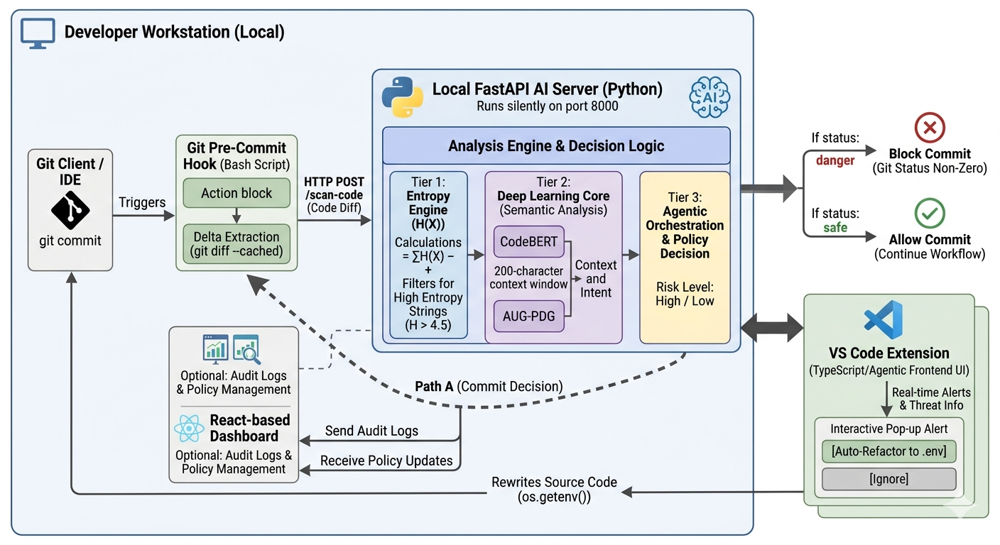

# 🧠 Neural Sentinel



## 📖 Abstract

**Neural Sentinel** is an advanced, AI-powered static code analysis and security auditing tool designed to proactively protect your codebase. Traditional secret scanners often struggle with high false positive rates or fail to understand the semantic context of variables. Neural Sentinel bridges this gap by combining the structural precision of Abstract Syntax Trees (AST) via **Tree-sitter** with the contextual intelligence of a **Fine-Tuned CodeBERT AI Model**.

Whether used as a local contextual server or a rigorous **Git Pre-commit Hook**, Neural Sentinel provides a hybrid approach to threat detection (Entropy Analysis + AI inference). It effectively catches hardcoded secrets (API keys, passwords, tokens) and structural vulnerabilities (such as logical flaws or infinite loops) in real-time, blocking insecure commits before they ever reach your remote repository.

## 🏗️ Project Structure

The project is structured into three main components:

```
Neural Sentinel/
├── architecture.png              # System Architecture Diagram
├── neural_sentinel_core/         # 🧠 Python Backend & AI Engine
│   ├── server.py                 # FastAPI Context Server for scanning & logs
│   ├── audit_engine.py           # Core logic for the pre-commit Git hook
│   ├── entropy_logic.py          # Shannon Entropy checks for secrets
│   ├── database.py               # SQLite database for Audit Logs
│   ├── neural-sentinel-finetuned/# The Fine-tuned CodeBERT model
│   └── ...                       # Model training and metric evaluators
├── neural-sentinel-dashboard/    # 📊 Frontend Dashboard (React + Vite)
│   ├── src/                      # UI components for viewing audit logs
│   ├── index.html
│   └── package.json
└── scripts/                      # 🛠️ Installation & Setup Scripts
    ├── global_installer.py       # Script to install Neural Sentinel globally
    └── pre_commit_hook.sh        # Shell wrapper for git hooks
```

## 🚀 How to Use

### 1. Prerequisites
- **Python 3.8+** (for the Core AI Engine)
- **Node.js 18+** (for the Dashboard)
- Git (if using the pre-commit hook)

### 2. Setting up the Core Engine (Backend)

Navigate to the `neural_sentinel_core` directory and install the necessary Python dependencies.

```bash
cd neural_sentinel_core
pip install -r requirements.txt # (Assuming dependencies are listed, else install fastapi, tree-sitter, transformers, etc.)
```

**To run the Context Server (FastAPI):**
```bash
uvicorn server:app --reload --port 8000
```
This will start the backend server, initializing the fine-tuned CodeBERT model and connecting to the SQLite database to store audit logs.

### 3. Setting up the Dashboard (Frontend)

Open a new terminal and navigate to the dashboard directory.

```bash
cd neural-sentinel-dashboard
npm install
npm run dev
```
The Vite development server will start, typically on `http://localhost:5173`. Open this URL in your browser to view the real-time audit logs and scan results.

### 4. Installing the Git Pre-commit Hook

Neural Sentinel can be installed as a global or repository-level git hook to block commits containing sensitive data or logical flaws.

Navigate to the `scripts` directory:
```bash
cd scripts
python global_installer.py
```
*Alternatively, you can manually copy `pre_commit_hook.sh` into your target repository's `.git/hooks/pre-commit` and ensure it is executable (`chmod +x`).*

Once installed, simply attempt to commit code containing a hardcoded secret. Neural Sentinel will parse the staged files, evaluate the AST, run the hybrid AI check, and **block the commit** if a threat is detected!

---
*Built with ❤️ to keep your codebase secure.*
